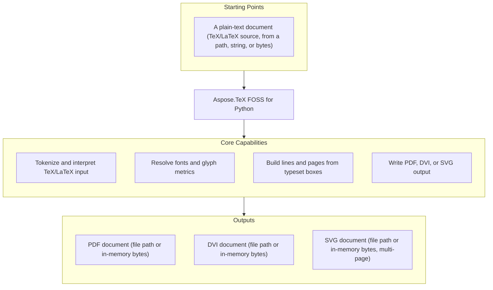

# Aspose.TeX FOSS for Python

[](LICENSE) [](pyproject.toml) [](#scope-and-limitations)

[](https://products.aspose.org/tex/python/)

Aspose.TeX FOSS for Python is a free, open-source, pure-Python library for TeX/LaTeX processing.
It parses real TeX/LaTeX source through its own from-scratch interpreter and produces PDF, DVI,
and SVG output, with no external TeX installation required — Computer Modern fonts ship bundled
inside the package.

## Navigation

- [At a Glance](#at-a-glance)
- [Key Capabilities](#key-capabilities)
- [Installation](#installation)
- [Dependencies](#dependencies)
- [Quick Start](#quick-start)
- [Additional Examples](#additional-examples)
- [API Reference](#api-reference)
- [Documentation & Resources](#documentation--resources)
- [Scope and Limitations](#scope-and-limitations)
- [Development and Testing](#development-and-testing)
- [License](#license)

## At a Glance



## Key Capabilities

- Parse and interpret real TeX/LaTeX source through `TeXJob`, driving the tokenizer, macro
  expander, and mode-machine dispatch that process control sequences, groups, and paragraph text.
- Resolve font metrics and glyph outlines from the bundled Computer Modern `.tfm` / `.pfb` data,
  independent of the output format a job targets.
- Build lines and pages from typeset boxes with a real line-breaking and page-building pipeline,
  then hand each finished page to an `OutputDevice`.
- Write finished pages through `PdfDevice`, `DviDevice`, or `SvgDevice` — pass a `Path` for file
  output, or leave the destination empty for in-memory `bytes`.
- `SvgDevice` embeds glyph outlines straight from the bundled Computer Modern PFB fonts as
  `<path>` elements, so the rendered SVG needs no external fonts; `get_all_pages()` returns every
  page of a multi-page document as a list of byte strings.
- Configure a job with `TeXOptions` — job name, magnification, and `extra_format_paths`, which is
  searched after the bundled format data and before the current working directory for `\input`
  files.
- Collect run diagnostics via `TeXJob.messages`, which returns a copy of the messages collected
  during the most recent run: `\message` and `\write 16` append plain-text entries,
  `\errmessage` prefixes them with `! `, and `\write -1` logs through the standard `aspose_tex`
  logger without appearing in the returned list.

## Installation

**Requirements**: Python 3.10+.

No PyPI package has been published for this library yet — install it from source:

```bash
git clone https://github.com/aspose-tex-foss/Aspose.TeX-FOSS-for-Python.git
cd Aspose.TeX-FOSS-for-Python
pip install -e .
```

For development (adds `pytest`, `ruff`, `build`, and `twine`):

```bash
pip install -e ".[dev]"
```

## Dependencies

### Required Package Dependencies

No required third-party package dependencies. The published `aspose-tex` package builds from
`pyproject.toml`, which declares no `[project.dependencies]` entries.

### Native and System Requirements

- Requires Python 3.10 or later (`requires-python = ">=3.10"`).

### Development Dependencies

- `pytest` (>=7.4), `ruff` (>=0.4), `build` (>=1.2), and `twine` (>=5.0) — the test runner,
  linter, and packaging/publishing tools used for development; `tomli` (>=2.0) is an additional
  dev dependency on Python versions before 3.11. None of these are required to use the library
  itself.

## Quick Start

```python
from aspose_tex import TeXJob, TeXOptions, PdfDevice, create_input_source

source = create_input_source("Hello World\n\\bye")
device = PdfDevice()
job = TeXJob(source, device, options=TeXOptions(load_format=False))
pdf_bytes = job.run()
```

`create_input_source` accepts a `Path`, a `str`, or `bytes`. Pass a `Path` to `PdfDevice` instead
of leaving it empty to write straight to disk — `run()` then returns `None` and the file holds the
output:

```python
from pathlib import Path
from aspose_tex import TeXJob, TeXOptions, PdfDevice, create_input_source

source = create_input_source("Hello World\n\\bye")
device = PdfDevice(Path("hello.pdf"))
job = TeXJob(source, device, options=TeXOptions(load_format=False))
job.run() # hello.pdf is written to disk
```

## Additional Examples

<details>
<summary>View Additional Code Examples</summary>

### DVI Output

```python
from aspose_tex import TeXJob, TeXOptions, DviDevice, create_input_source

source = create_input_source("Hello World\n\\bye")
device = DviDevice()
job = TeXJob(source, device, options=TeXOptions(load_format=False))
dvi_bytes = job.run()
```

DVI can also be written directly to a file instead of into memory:

```python
from pathlib import Path
from aspose_tex import TeXJob, TeXOptions, DviDevice, create_input_source

source = create_input_source("Hello World\n\\bye")
device = DviDevice(Path("hello.dvi"))
job = TeXJob(source, device, options=TeXOptions(load_format=False))
job.run()  # returns None; output is on disk
```

### SVG Output

```python
from aspose_tex import TeXJob, TeXOptions, SvgDevice, create_input_source

source = create_input_source("Hello World\n\\bye")
device = SvgDevice()
job = TeXJob(source, device, options=TeXOptions(load_format=False))
svg_bytes = job.run()  # UTF-8 encoded SVG 1.1 document
```

Writing to a file path picks the file name automatically (`hello.svg`, or `hello-1.svg` /
`hello-2.svg` for a multi-page document):

```python
from pathlib import Path
from aspose_tex import TeXJob, TeXOptions, SvgDevice, create_input_source

source = create_input_source("Hello World\n\\bye")
device = SvgDevice(Path("output/hello"))
job = TeXJob(source, device, options=TeXOptions(load_format=False))
job.run()  # writes output/hello.svg
```

A multi-page document run in memory returns one SVG byte string per page:

```python
from aspose_tex import TeXJob, TeXOptions, SvgDevice, create_input_source

source = create_input_source("Page one\n\\eject\nPage two\n\\bye")
device = SvgDevice()
job = TeXJob(source, device, options=TeXOptions(load_format=False))
job.run()
pages = device.get_all_pages()  # list[bytes], one SVG per page
```

### Job Options

```python
from aspose_tex import TeXJob, TeXOptions, PdfDevice, create_input_source

opts = TeXOptions(job_name="hello", magnification=1200, load_format=False)
source = create_input_source("Hello World\n\\bye")
device = PdfDevice()
job = TeXJob(source, device, options=opts)
pdf_bytes = job.run()
```

### Messages and Logging

```python
from pathlib import Path
from aspose_tex import TeXJob, TeXOptions, DviDevice, create_input_source

opts = TeXOptions(load_format=False, extra_format_paths=[Path("tex-inputs")])
source = create_input_source("\\input chapter1\n\\bye")
job = TeXJob(source, DviDevice(), options=opts)
dvi_bytes = job.run()
messages = job.messages
```

The `extra_format_paths` option above is searched after the bundled format data and before the
current working directory when resolving `\input` files. To see log output from the engine (the
package attaches only a `logging.NullHandler` by default):

```python
import logging

logging.basicConfig(level=logging.INFO)
logging.getLogger("aspose_tex").setLevel(logging.INFO)
```

</details>

## API Reference

The primary entry point is `TeXJob`, which combines an `InputSource`, an `OutputDevice`
(`PdfDevice`, `DviDevice`, or `SvgDevice`), and `TeXOptions` into one runnable job.

<details>
<summary>View the Core API Surface</summary>

### Core API

| Class | Description |
|---|---|
| `AsposeTeXError` | Base exception for all aspose_tex errors. |
| `EngineError` | Raised for TeX engine errors (infinite recursion, undefined register, etc.). |
| `FontError` | Raised for font-related failures (TFM not found, corrupt file, invalid char, etc.). |
| `InputError` | Raised for input reading failures (file not found, stack underflow, etc.). |

### Presentation

| Class | Description |
|---|---|
| `DviDevice` | DVI output device — wraps `DviWriter`. |
| `OutputDevice` | Abstract base class for all output devices. |
| `PdfDevice` | PDF output device — wraps `PdfWriter`. |
| `SvgDevice` | SVG output device — wraps `SvgWriter`. |
| `TeXJob` | Main entry point for processing TeX input. |
| `TeXOptions` | Configuration for a TeX processing job — job name, magnification, and font/format search paths. |

#### Enumerations

| Enumeration | Description |
|---|---|
| `OutputFormat` | Supported output formats: `DVI`, `PDF`, `SVG`. |

---

#### Detailed Member Reference

### Processing

- `TeXJob`
  - `TeXJob(source, device, options=None)`
  - `run() -> bytes | None`
  - `messages -> list[str]`
- `TeXOptions`
  - `job_name: str = "texput"`
  - `magnification: int = 1000`
  - `extra_font_paths: list[Path]`
  - `load_format: bool | str | None = "plain"`
  - `extra_format_paths: list[Path]`

### Output Devices

- `OutputDevice`
  - `destination -> Path | io.BytesIO`
  - `finalize()`
  - `get_bytes() -> bytes | None`
- `PdfDevice(destination=None)`
- `DviDevice(destination=None)`
- `SvgDevice(destination=None)`
  - `get_all_pages() -> list[bytes] | None`

### Input Sources

- `create_input_source(source)` — factory returning a `FileInputSource` or `StringInputSource`
  from a `Path`, `str`, or `bytes`.

### Exceptions

- `AsposeTeXError` — base exception for the package.
- `InputError`
- `EngineError`
- `FontError`

</details>

## Documentation & Resources

- **[Getting started guide](https://docs.aspose.org/tex/python/)** — installation, walkthroughs, and feature guides for this library.
- **[How-to guides & FAQ](https://kb.aspose.org/tex/python/)** — task-focused answers for common TeX/LaTeX-processing questions.
- **[Full API reference](https://reference.aspose.org/tex/python/)** — the complete, browsable reference for the public API surface (the [API reference](#api-reference) section above covers the essentials).
- Found a bug or have a feature request? [Open an issue](https://github.com/aspose-tex-foss/Aspose.TeX-FOSS-for-Python/issues) on GitHub.

## Scope and Limitations

- This is a Pre-Alpha release: the core engine and public API are under active development, and
  interfaces may change between releases.
- The default `load_format="plain"` option (`TeXOptions`) does not yet fully load Knuth's Plain
  TeX macro cascade in this milestone — every example above passes `load_format=False` for a
  runnable, from-primitives document.
- Math-mode content (`$...$`, `$$...$$`) is parsed through a shell surface but not laid out — no
  math atoms, fractions, or radicals reach the page.
- Table alignment (`\halign`, `\valign`) is registered but not implemented — invoking either
  raises `NotImplementedError`.
- Automatic hyphenation is not active: `\patterns` and `\hyphenation` are parsed and discarded,
  and the bundled `hyphenation/` pattern directory is currently empty; `\hyphenchar` and the
  hyphenation-penalty parameters are supported but have no pattern data to apply.
- Named file-stream I/O (`\openin`, `\openout`, `\closein`, `\closeout`, `\read`) raises
  `NotImplementedError` — only `\write 16` (message log), `\write -1` (silent log), `\message`,
  and `\errmessage` are implemented; `\ifeof` always evaluates false.

These limitations don't apply to
[Aspose.TeX for Python — Enterprise Edition](https://products.aspose.com/tex/python-net/), which
adds full feature completeness, broader format coverage, and commercial support.

## Development and Testing

Install the development extras and run the test suite:

```bash
pip install -e ".[dev]"
pytest
```

68 test modules cover the tokenizer, macro expander, box and page builder, font subsystem, and
each output writer, including an automated end-to-end suite that compiles fixture documents
through the public `TeXJob` API and compares the result against committed MiKTeX-generated DVI
baselines — semantically (page count, glyph stream, line and rule positions, font metadata), not
byte-for-byte, so the suite has no MiKTeX dependency at test time. Lint with:

```bash
ruff check .
```

The package registers a `logging.NullHandler` on the `aspose_tex` logger, so integrating
applications can opt into standard Python logging without unexpected default-handler warnings.

## License

This project is licensed under the [MIT License](LICENSE). The MIT License permits use, copying,
modification, distribution, sublicensing, and commercial use, provided its copyright and
permission notice are retained. The software is provided without warranty.

Bundled Computer Modern fonts are covered separately — see the [font license file](LICENSE-FONTS).
